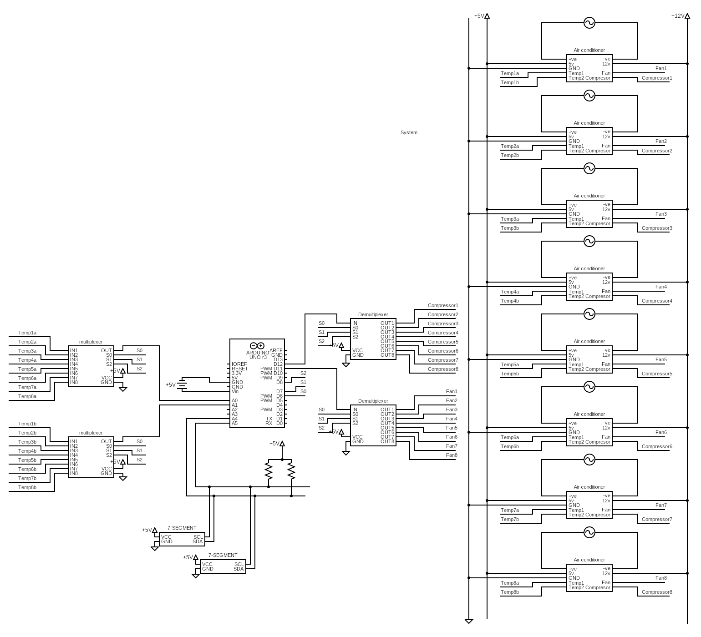

# Problem Description

Design a system that controls 8 Air Conditioners (ACs).

Each Air Conditioner consists of 220V/10A AC Compressor, 12V DC Fan, and 2 temperature sensors (averaged for accuracy)

If the currently operating AC is unable to reach the required temperature within 60 minutes, a red alarm LED is lighted and the system switches off the compressor.

You have 2*7-Segment I2C module, push buttons, and assume the temperature sensor
is AD22100 use any other components you may need.

The User can do the following:
- Switch between the 8 ACs
- Change the fan speed (1 -> 5)
- Change Temperature (18 -> 30)

# System Components
- 8 ACs, each have
  - Compressor
  - Fan
  - 2 Temperature sensors (averaged for accuracy)
- 4 Buttons:
  - UP
  - DOWN
  - MODE (required temperature, current AC, fan speed)
- Alarm Led
- Seven Segment Display
  >> Operational Voltage 5V , uses I2C protocol, Write Address for 1st 7 Segment is 53h , Write
Address for 2nd 7 Segment is 43h , both has internal registers address 50h

# Schematic
<details> <summary>Click to expand...</summary>

## ACs


## System Schematic
We will use Demultiplexeres to switch between ACs. We will use the same selection bits for the fans and temperature sensors



</details>


# Assumptions
- The seven segment display is used to show the required temperature.
# System Intended Behavior  
- The fan operates on the specified speed.
- The compressor is always on when the AC is on.
- The compressor is off when the required temperature is met.
- If an AC didn't manage to reach the required temperature within 60 minutes, the alarm led is lit and the AC is switched off.
- The user is the only one who can change the switched on AC.

# Modules
## Setup the System 
<details> <summary>Click to expand...</summary>

Here we setup our pins' direction, whether they are in or out.

``` c++
void setup() {
  wire.begin();
  pinMode(UP_PB, INPUT);
  pinMode(DOWN_PB, INPUT);
  pinMode(MODE_PB, INPUT);

  pinMode(ALARM_LED, OUTPUT);

  // ACs (3 bits for 8 ACs)
  pinMode(addressAC0, OUTPUT);
  pinMode(addressAC1, OUTPUT);
  pinMode(addressAC2, OUTPUT);
  // Note that, we don't need to set the direction of the temperature sensors nor the fans (analog pins), since they are already set to input. 
}
```
</details>

## Calculate Temperature
<details> <summary>Click to expand...</summary>

How can we calculate the temperature? we are given two parameters: the bias and the slope.
In other words we have this line: Y(voltage) = m * X(temperature) + c
So, X(temperature) = (Y(voltage) - c) / m
>> Note that, the slope is given in mV, so we need to convert it to V by dividing by 1000.

``` c++
float readTemperatureSensor(int sensor) {
  float voltage = analogRead(sensor) * (5.0 / 1023.0);
  float temperature = (voltage-1.375) / 0.0225;
  return temperature;
}
```
Or simply:
``` c++
float readTemperatureSensor(int sensor) {
  float voltage = analogRead(sensor) * (5.0 / 1023.0);
  return (voltage-1.375) / 0.0225;
}
```
In our case, we have two sensors for each AC, they are selected based on the AC address bits, so we will read the common pins directly.
``` c++
float calculateTemperature() {
  return (readTemperatureSensor(temperature_sensor_1) + readTemperatureSensor(temperature_sensor_2)) / 2;
}
```
I know that you are wondering why have calculated the temperatures then averaged it, we could simply averaged the voltage readings then calculated the temperature only once. We didn't do this for the exact same reason. We want to abstract the temperature calculations as much as we can. Hence, if we have replaced the sensor, for instance with a non linear one, the rest of the code can be unchanged. 
</details>

## Read Push Buttons
<details>
<summary>Click to expand...</summary>

Hey bro, a whole module for the push buttons?! well, dealing with push buttons are not that straightforward you know. Push buttons have a property called debouncing, that we need to deal with, to prevent the system from reacting to the same push button multiple times. 

There are two main approaches -as far as I know- to solve this issue: 

### 1. using delays:
``` c++
int readPushButton(int pb)
{
  if (digitalRead(pb) == HIGH)
  {
    delay(DEBOUNCE_DELAY); // usually 30 ~ 50ms
    if (digitalRead(pb) == HIGH) // if the button is still pressed
      return 1;
    else 
        return 0;
  }
  return 0;
}
```
### 2. using loops:
``` c++
int readPushButton(int pb)
{
  if (digitalRead(pb) == HIGH)
  {
    while(digitalRead(pb) == HIGH); // stay here until button is released
    return 1;
  }
  return 0;
}
```

</details>


## Update fan level
<details> <summary>Click to expand...</summary>

The fan can have up to `MAX_NUMBER_FAN_LEVELS` levels. The fan speed is calculated based on this level.

>> You con use switches or if conditions, but I think this way is more readable.

``` c++
void updateFanLevel(int inc) {
  currentFanLevel += inc % MAX_NUMBER_FAN_LEVELS; 
  currentFanSpeed = currentFanSpeed < 0 ? 0 : currentFanSpeed;
  currentFanSpeed = currentFanLevel * (255.0 / MAX_NUMBER_FAN_LEVELS)

}
```
</details>

## Update Current AC
<details> <summary>Click to expand...</summary>

``` c++
void updateCurrentAC(int incrementValue)
{
  temperatureTimeOfChange = millis()/(60e3); // calculate new value for the newly switched on AC
  // update the value of the currentAC
  currentAC += inc % MAX_NUMBER_AC;
  currentAC = currentAC < 0 ? 0 : currentAC;
  // reflect the value on the selection pins
  digitalWrite(addressAC0, currentAC & 0x1); // bit 0 -> xx(x) & 001
  digitalWrite(addressAC1, currentAC & 0x2); // bit 1 -> x(x)x & 010
  digitalWrite(addressAC2, currentAC & 0x4); // bit 2 -> (x)xx & 100
  // Great way I know, thanks <3
}
```
</details>


## Control ACs
<details> <summary>Click to expand...</summary>

Here, we have made two utility functions to help us control the fans and get more abstractions. We don't need to specify which AC we are using, as we the Mux will handle it based on the passed selection bits.
``` c++
void controlAC(int fanSpeed, int compressor) {
  analogWrite(FAN_SPEED_PIN, fanSpeed);
  analogWrite(COMPRESSOR_PIN, compressor);
}
```
</details>

## Work with the 7-segment display
<details> <summary>Click to expand...</summary>
To start working with the 7-segment display (I2C Protocol), we will use a built-in library called `Wire`.

We need to instantiate it in the setup using `wire.begin()`.

To pass value using I2C, we go through 4 main steps:
- Begin the transmission using the slave address: ``` wire.beginTransmission(SLAVE_ADDRESS); ``` 
- Select the required registerAddress (optional): ``` wire.write(registerAddress); ```
- Write the value you want to pass: ``` wire.write(value); ```
- End the transmission: ``` wire.endTransmission(); ```

``` c++
void passValueByI2C(int slaveAddress, int registerAddress, int value)
{
  Wire.beginTransmission(slaveAddress);
  Wire.write(registerAddress);
  Wire.write(value);
  Wire.endTransmission();
}
```
Now, we wil display the value on the two seven segments we have. To get the first digit -units- use `value % 10` and to get the second digit -tens- use `value / 10`.

``` c++
void showOnSevenSegment(int value){
  passValueByI2C(SEVEN_SEG_1_ADDRESS, SEVEN_SEG_COMMON_ADDRESS, value % 10); // 1st digit
  passValueByI2C(SEVEN_SEG_2_ADDRESS, SEVEN_SEG_COMMON_ADDRESS, value / 10); // 2nd digit
}
```

</details>

## User Interface
<details> <summary>Click to expand...</summary>

The beauty of this module -function- is that we have abstracted all the system interface with the user in a single module. By user interface I mean the buttons and the display. 
### Mode
``` c++
  if (readPushButton(Mode) ) {
    Mode = (Mode++)%3; // Mode is 0, 1, 2. There a lot of ways to optimize this line.
  }
```
### Ups & Downs -UR life is only downs, sorry-
<details> <summary>Click to expand...</summary>

``` c++
  if ( readPushButton(UP_PB) ) {
    if(Mode == MODE_TEMPERATURE) {
      requiredTemp++;
      timeOfChange = millis()/(60e3); // reset the time when the temperature is changed
      showOnSevenSegment(requiredTemp); // show the requiredTemp on the display
    }
    else if(Mode == MODE_FAN_SPEED && currentFanLevel < MAX_NUMBER_FAN_LEVELS>) {
      currentFanLevel++;
    }
    else if(Mode == MODE_currentAC && currentAC < MAX_NUMBER_AC) {
      currentAC++;
    }
  }

  if ( readPushButton(DOWN_PB) ) {
    if(Mode == MODE_TEMPERATURE) {
      requiredTemp--;
       timeOfChange = millis()/(60e3); // reset the time when the temperature is changed
      showOnSevenSegment(requiredTemp); // show the requiredTemp on the display
    }
    else if(Mode == MODE_FAN_SPEED && currentFanLevel > 0) {
      currentFanLevel--;
    }
    else if(Mode == MODE_currentAC && currentAC > 0) {
      currentAC--;
    }
  }
```
Read the code and focus for one minute and you will get the idea. 
We can optimize the code by using a switch statement. 
We can eliminate some redundant code  and do some abstraction using this:
``` c++
int inc  = 0;
inc = readPushButton(UP_PB) ? 1 : inc;
inc = readPushButton(DOWN_PB) ? -1 : inc;

  if (inc != 0) {
      if(Mode == MODE_TEMPERATURE) {
        requiredTemp += inc;
        temperatureTimeOfChange = millis()/(60e3); // reset the time when the temperature is changed
      showOnSevenSegment(requiredTemp); // show the requiredTemp on the display
      }
      else if(Mode == MODE_FAN_SPEED) {
        updateFanLevel(inc);
      }
      else if(Mode == MODE_currentAC) {
        updateCurrentAC(inc);
      }
    }

// There is a room for a lot of optimization here, but I prefer readable code. 
</details>

<details> <summary>Click to expand...</summary>

```
The Whole Function: 
``` c++
void userInterface() {
  if ( readPushButton(Mode) ) {
    Mode = (Mode++)%3;
  }
  int inc  = 0;
  inc = readPushButton(UP_PB) ? 1 : inc;
  inc = readPushButton(DOWN_PB) ? -1 : inc;

  if (inc != 0) {
      if(Mode == MODE_TEMPERATURE) {
        requiredTemp += inc;
        temperatureTimeOfChange = millis()/(60e3); // reset the time when the temperature is changed
        showOnSevenSegment(requiredTemp); // show the requiredTemp on the display
      }
      else if(Mode == MODE_FAN_SPEED) {
        updateFanLevel(inc);
      }
      else if(Mode == MODE_currentAC) {
        updateCurrentAC(inc);
      }
    }
}
```
</details>

</details>

## System Behavior
<details> <summary>Click to expand...</summary>

Here, we implement our logic for the system.
>> Note that, we don't have ON/OFF States here.

We have two main blocks:

### 1. Check if we need to alternate
<details> <summary>Click to expand...</summary>

``` c++
long long currentTime = millis()/(60e3); // get the currentTime
// check if we need to alternate ACs
if (currentTime - temperatureTimeOfChange > 60min) // 60 minutes has passed
{
  // alternate if we haven't met the requiredTemp 
  if (calculateTemperature() > requiredTemp) 
  {
    updateCurrentAC(1); // go to the next one
    alarmState = HIGH; // alarm is on 
    temperatureTimeOfChange = currentTime; // update the temperatureTimeOfChange
  }
}
```
</details>

### 2. Check if we need to turn on/off the AC
<details> <summary>Click to expand...</summary>

``` c++
// check if we need to close the ACs
if (calculateTemperature() <= requiredTemp)
{
  temperatureTimeOfChange = currentTime; // update the temperatureTimeOfChange
  controlAC(fanSpeed, LOW);
}
else 
{
  controlAC(fanSpeed, HIGH);
  alarmState = LOW; // switch off the alarm
}
```
</details>

### Now, function is
<details> <summary>Click to expand...</summary>

``` c++
void systemBehavior() {
  
  digitalWrite(ALARM_LED, alarmState);
  long long currentTime = millis()/(60e3); // get the currentTime
  // check if we need to alternate ACs
  if (currentTime - temperatureTimeOfChange > 60min) // 60 minutes has passed
  {
    // alternate if we haven't met the requiredTemp 
    if (calculateTemperature() > requiredTemp) 
    {
      updateCurrentAC(1); // go to the next one
      alarmState = HIGH; // alarm is on 
      temperatureTimeOfChange = currentTime; // update the temperatureTimeOfChange
    }
  }
  ////////////////////////////////////////////////////////////////////////////////////////////////
  // check if we need to close the ACs
  if (calculateTemperature() <= requiredTemp)
  {
    temperatureTimeOfChange = currentTime; // update the temperatureTimeOfChange
    controlAC(fanSpeed, LOW);
  }
  else 
  {
    controlAC(fanSpeed, HIGH);
    alarmState = LOW; // switch off the alarm
  }
}
```

</details>

## Finally, the main loop
```c++
void loop() {
  userInterface();
  systemBehavior();
}
```
</details>

# Whole Code
[code](code.ino)
