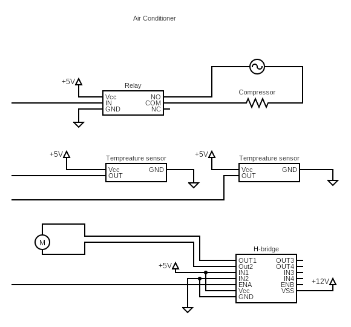
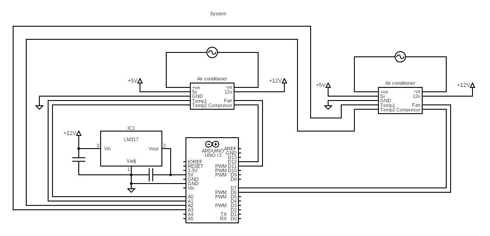

# Problem Description

Design a system that controls 2 ACs -Air Conditioner- that alternate every x hours. 

The system consists of 2 ACs and 4 push buttons: ON/OFF, UP, DOWN, MODE.
The ON/OFF button turns the whole system on or off. The UP/DOWN buttons are used to control the required temperature, fan speed, or alternating interval (in hours).  The MODE button is used to scroll through different functionalities of the UP/DOWN buttons. 

Each AC operates at 220v and consists of a compressor, a fan with variable speeds, and 2 temperature sensors (averaged for accuracy). 

If the currently operating AC is unable to reach the required temperature within 5 minutes, an alarm led is lighted and the system switches to the other AC until it is reset.

# System Components
- 2 ACs, each have
  - Compressor
  - Fan
  - 2 Temperature sensors (averaged for accuracy)
- 4 Buttons:
  - ON/OFF
  - UP
  - DOWN
  - MODE (required temperature, interval, fan speed)
- Alarm Led
# Schematic
<details> <summary>Click to expand...</summary>

## ACs


## System Schematic


</details>

# Assumptions
- Temperature sensors are linear.
- Fan speed has 225 values (0 ~ 255).
# System Intended Behavior  
- The fan operates on the specified speed.
- The compressor is always on when the AC is on.
- The compressor is off when the required temperature is met.
- The ACs alternate every x hours.
- If an AC didn't manage to reach the required temperature within 5 minutes, the alarm led is lit and the other AC is used instead.

# Modules
## Setup the System 
<details> <summary>Click to expand...</summary>

Here we setup our pins' direction, whether they are in or out.

``` c++
void setup() {
    // push buttons
    pinMode(ON_OFF_PB, INPUT);
    pinMode(UP_PB, INPUT);
    pinMode(DOWN_PB, INPUT);
    pinMode(MODE_PB, INPUT);
    // compressors
    pinMode(Compressor1, OUTPUT);
    pinMode(Compressor2, OUTPUT);
    // error LED
    pinMode(ALERT_LED, OUTPUT);
    // Note that, we don't need to set the direction of the temperature sensors nor the fans (analog pins), since they are already set to input. 
}
```
</details>

## Calculate Temperature
<details> <summary>Click to expand...</summary>

How can we calculate the temperature? we are given two parameters: the bias and the slope.
In other words we have this line: Y(voltage) = m * X(temperature) + c
So, X(temperature) = (Y(voltage) - c) / m
>> Note that, the slope is given in mV, so we need to convert it to V by dividing by 1000.

``` c++
float readTemperatureSensor(int sensor) {
  float voltage = analogRead(sensor) * (5.0 / 1023.0);
  float temperature = (voltage-1.375) / 0.0225;
  return temperature;
}
```
Or simply:
``` c++
float readTemperatureSensor(int sensor) {
  float voltage = analogRead(sensor) * (5.0 / 1023.0);
  return (voltage-1.375) / 0.0225;
}
```
In our case, we have two sensors for each AC, so we need to calculate the average of two sensors based on which AC we are using now:
``` c++
float calculateTemperature(int AC) {
    if (AC == AC1) {
        return (readTemperatureSensor(temperature_sensor_AC1_1) + readTemperatureSensor(temperature_sensor_AC1_2)) / 2;
    } else if (AC == AC0) {
        return (readTemperatureSensor(temperature_sensor_AC0_1) + readTemperatureSensor(temperature_sensor_AC0_2)) / 2;
    }
}
```
I know that you are wondering why have calculated the temperatures then averaged it, we could simply averaged the voltage readings then calculated the temperature only once. We didn't do this for the exact same reason. We want to abstract the temperature calculations as much as we can. Hence, if we have replaced the sensor, for instance with a non linear one, the rest of the code can be unchanged. 
</details>

## Read Push Buttons
<details>
<summary>Click to expand...</summary>

Hey bro, a whole module for the push buttons?! well, dealing with push buttons are not that straightforward you know. Push buttons have a property called debouncing, that we need to deal with, to prevent the system from reacting to the same push button multiple times. 

There are two main approaches -as far as I know- to solve this issue: 

### 1. using delays:
``` c++
int readPushButton(int pb)
{
  if (digitalRead(pb) == HIGH)
  {
    delay(DEBOUNCE_DELAY); // usually 30 ~ 50ms
    if (digitalRead(pb) == HIGH) // if the button is still pressed
      return 1;
    else 
        return 0;
  }
  return 0;
}
```
### 2. using loops:
``` c++
int readPushButton(int pb)
{
  if (digitalRead(pb) == HIGH)
  {
    while(digitalRead(pb) == HIGH); // stay here until button is released
    return 1;
  }
  return 0;
}
```
</details>

## Control ACs
<details> <summary>Click to expand...</summary>

Here, we have made two utility functions to help us control the fans and get more abstractions. 
``` c++
void controlAC(int AC, int fanSpeed, int compressor) {
    if (AC == AC1) {
        analogWrite(Fan1, fanSpeed);
        digitalWrite(Compressor1, compressor);
    } else if (AC == AC0) {
        analogWrite(Fan2, fanSpeed);
        digitalWrite(Compressor2, compressor);
    }
}
```
</details>

## User Interface
<details> <summary>Click to expand...</summary>

The beauty of this module -function- is that we have abstracted all the system interface with the user in a single module. By user interface I mean the buttons. 
### ON/OFF State
``` c++
  if ( readPushButton(ON_OFF_PB) ) {
    OnOff = !OnOff;
  }
```
### Mode
``` c++
  if ( readPushButton(Mode) ) {
    Mode = (Mode++)%3; // Mode is 0, 1, 2. There a lot of ways to optimize this line.
  }
```
### Ups & Downs -UR life is only downs, sorry-
<details> <summary>Click to expand...</summary>

``` c++
  if ( readPushButton(UP_PB) ) {
    if(Mode == MODE_TEMPERATURE) {
      requiredTemp++;
      timeOfChange = millis(); // reset the time when the temperature is changed
    }
    else if(Mode == MODE_FAN_SPEED && currentFanSpeed < 255>) {
      currentFanSpeed++;
    }
    else if(Mode == MODE_ALTERNATING_INTERVAL) {
      alternationTime+=60; // multiples of 60 minutes
    }
  }

  if ( readPushButton(DOWN_PB) ) {
    if(Mode == MODE_TEMPERATURE) {
      requiredTemp--;
       timeOfChange = millis(); // reset the time when the temperature is changed
    }
    else if(Mode == MODE_FAN_SPEED && currentFanSpeed > 0) {
      currentFanSpeed--;
    }
    else if(Mode == MODE_ALTERNATING_INTERVAL && alternationTime > 0) {
      alternationTime-=60; // multiples of 60 minutes
    }
  }
```
Read the code and focus for one minute and you will get the idea. 
We can optimize the code by using a switch statement. 
We can eliminate some redundant code using this:
``` c++
int inc  = 0;
inc = readPushButton(UP_PB) ? 1 : inc;
inc = readPushButton(DOWN_PB) ? -1 : inc;

if (inc != 0) {
    if(Mode == MODE_TEMPERATURE) {
      requiredTemp += inc;
      timeOfChange = millis(); // reset the time when the temperature is changed
    }
    else if(Mode == MODE_FAN_SPEED) {
      currentFanSpeed += inc;
      currentFanSpeed = currentFanSpeed > 255 ? 255 : currentFanSpeed;
      currentFanSpeed = currentFanSpeed < 0 ? 0 : currentFanSpeed;
    }
    else if(Mode == MODE_ALTERNATING_INTERVAL) {
      alternationTime += inc * 60; // multiples of 60 minutes
      alternationTime = alternationTime < 0 ? 0 : alternationTime;
    }
  }
// There is a room for a lot of optimization here, but I prefer readable code. 
</details>

<details> <summary>Click to expand...</summary>

```
The Whole Function: 
``` c++
void userInterface() {
  if ( readPushButton(ON_OFF_PB) ) {
    OnOff = !OnOff;
  }

  if ( readPushButton(Mode) ) {
    Mode = (Mode++)%3;
  }
  int inc  = 0;
  inc = readPushButton(UP_PB) ? 1 : inc;
  inc = readPushButton(DOWN_PB) ? -1 : inc;

  if (inc != 0) {
      if(Mode == MODE_TEMPERATURE) {
        requiredTemp += inc;
        temperatureTimeOfChange = millis(); // reset the time when the temperature is changed
      }
      else if(Mode == MODE_FAN_SPEED) {
        currentFanSpeed += inc;
        currentFanSpeed = currentFanSpeed > 255 ? 255 : currentFanSpeed;
        currentFanSpeed = currentFanSpeed < 0 ? 0 : currentFanSpeed;
      }
      else if(Mode == MODE_ALTERNATING_INTERVAL) {
        alternationTime += inc * 60; // multiples of 60 minutes
        alternationTime = alternationTime < 0 ? 0 : alternationTime;
      }
    }

}
```
</details>

</details>

## System Behavior
<details> <summary>Click to expand...</summary>

Here, we implement our logic for the system.

If the we are on the off state, switch everything off.
``` c++
if ( OnOff == OFF_STATE ) {
    //switch everything off
   controlAC(AC1, LOW, LOW);
   controlAC(AC0, LOW, LOW);
   digitalWrite(ALARM_LED, HIGH);
  }
```
if we the system if on, we have two main blocks:

### 1. Check if we need to alternate
<details> <summary>Click to expand...</summary>

``` c++
long long currentTime = millis(); // get the currentTime
// check if we need to alternate ACs
if (currentTime - timeOfSwitch > alternationTime)
{
    controlAC(currentAC, LOW, LOW); // close the currentAC
    currentAC = != currentAC; // alternate ACs
    timeOfChange = currentTime; // update the timeOfChange
    timeOfSwitch = currentTime; // update the timeOfSwitch
}
else if (currentTime - timeOfChange > 5min) // 5 minutes has passed
{
    // alternate if we haven't met the requiredTemp and we are not in the middle of an alternation
    if (calculateTemperature(currentAC) > requiredTemp) 
    {
        controlAC(currentAC, LOW, LOW); // close the currentAC
        currentAC = != currentAC; // alternate ACs
        alarmState = HIGH; // alarm is on 
        timeOfChange = currentTime; // update the timeOfChange
        timeOfSwitch = currentTime; // update the timeOfSwitch
    }
}
```
</details>

### 2. Check if we need to turn on/off the AC
<details> <summary>Click to expand...</summary>

``` c++
// check if we need to close the ACs
if (calculateTemperature(currentAC) <= requiredTemp)
{
    temperatureTimeOfChange = currentTime; // update the temperatureTimeOfChange
    controlAC(currentAC, fanSpeed, LOW);
}
else 
{
    controlAC(currentAC, fanSpeed, HIGH);
    alarmState = LOW; // switch off the alarm
}
```
</details>

### Now, function is
<details> <summary>Click to expand...</summary>

``` c++
void systemBehavior() {
  if ( OnOff == OFF_STATE ) {
    //switch everything off
    controlAC(AC1, LOW, LOW);
    controlAC(AC0, LOW, LOW);
    digitalWrite(ALARM_LED, LOW);
  }
  else {
      digitalWrite(ALARM_LED, alarmState);
      long long currentTime = millis(); // get the currentTime
     // check if we need to alternate ACs
     if (currentTime - timeOfSwitch > alternationTime)
      {
        controlAC(currentAC, LOW, LOW); // close the currentAC
        currentAC = != currentAC; // alternate ACs
        temperatureTimeOfChange = currentTime; // update the temperatureTimeOfChange
        timeOfSwitch = currentTime; // update the timeOfSwitch
      }
      else if (currentTime - temperatureTimeOfChange > 5min) // 5 minutes has passed
      {
        // alternate if we haven't met the requiredTemp and we are not in the middle of an alternation
        if (calculateTemperature(currentAC) > requiredTemp) 
        {
          controlAC(currentAC, LOW, LOW); // close the currentAC
          currentAC = != currentAC; // alternate ACs
          alarmState = HIGH; // alarm is on 
          temperatureTimeOfChange = currentTime; // update the temperatureTimeOfChange
          timeOfSwitch = currentTime; // update the timeOfSwitch
        }
      }
      ////////////////////////////////////////////////////////////////////////////////////////////////
      // check if we need to close the ACs
      if (calculateTemperature(currentAC) <= requiredTemp)
      {
        temperatureTimeOfChange = currentTime; // update the temperatureTimeOfChange
        controlAC(currentAC, fanSpeed, LOW);
      }
      else 
      {
        controlAC(currentAC, fanSpeed, HIGH);
        alarmState = LOW; // switch off the alarm
      }
  }
}
```
</details>

## Finally, the main loop
```c++
void loop() {
  userInterface();
  systemBehavior();
}
```
</details>

# Whole Code
[code](code.ino)
